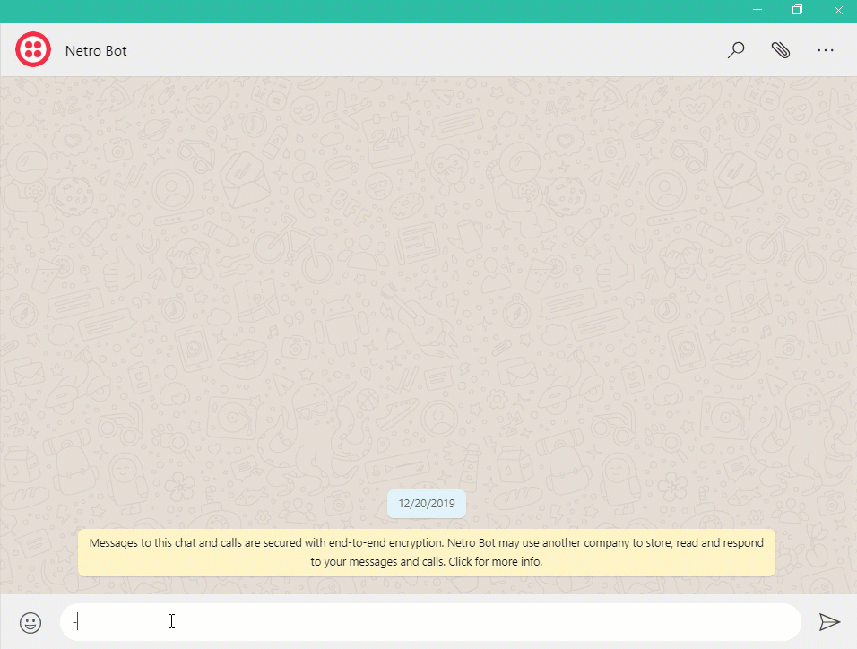

## E-shop whatsapp bot template
- A some-what bare template for whatsapp chatbot..originally made using twilio sandbox
- original proposal was tailored towards an electronic startup that sells electronic components
- can be extended or changed to suit any business type with minor or major tweaks

### Demos
- this is not an AI-ML bot, an example of an AI bot with ML can be found [here, ZIMSEC bot](https://github.com/DonnC/zimsec-results-bot)
- This example bot `On development app`, has many sides, here i show 2, how it works for both a **client** and the **moderator**
- ..seperately with no problem 😎
- Click this link to [whatsapp bot](https://wa.me/14155238886?text=join%20had-firm). After that you can type **hie** or **hello** or **start**.
- Consumer / client side

- Moderator side

### Note
- Well, as much as i try to give out my thoughts to the public, `EXCEPTION HANDLING` is to be done by the interested personnel in this project

### Technologies
- This whatsapp bot makes use of twilio sandbox for prototyping
- Needs twilio credentials, login to your twilio console and replace yr keys in [credentials.py](src/credentials.py)
- Can host on heroku free tier and choose automatic deployment from your github master branch
- bulksms service can be used depending on use case, one such service is bulksmszw and ther is a library for that at [bulksms zw api library](https://github.com/DonnC/BulkSmsZW-Api)
- or if its hot-recharge services like `TechZim airtime bot`, can integrate it using the [hot-recharge zw api library](https://github.com/DonnC/Hot-Recharge-ZW) *still testing, raise issues and star for updates.

### Structure
- `whether this is a good design structure | not, this worked for me` - you can change depending on your project or business model
- in [src](src/) folder, it handles all the bot functionalities subdivided into different modules to aid in upgrading the bot later
- most bot utilities are implemented inside [utils.py](src/utils.py)
- statistics are in a seperate folder e.g [stats](stats/development/devlog.log)
- commands and help texts are in their seperate e.g [folder](files/help.txt)

### How to run
- clone or fork this repo!
- for cloud serving, you can use heroku free account and choose automatic deploy from your bot github repository
- needs a twilio account and twilio tokens and sandbox ready, check the twilio website
- for local testing, fire up your flask server and run ngrok (needs Ngrok installed)
- you can google on the internet how to do so, there is a tutorial about that
- run some tests, and show off to friends, family and clients 😉

#### tip
- after successful deployment to heroku, use your free heroku url to add to twilio console on callback webhook
- as `https://your-heroku-url/whatsapp` and let magic rain, your bot is automatically now linked between the 2 and is now online 24/7
- for local testing with ngrok, use `https://your-temporary-ngrok-https-url/whatsapp` on the twilio console. Dont use the `http` url

- Make bots like what the banks have, like what that whatsapp bot you admired works, be creative 👨‍🎨

### Appericiation
- If you like this sort of bot template helpful give it a STAR 🌟 or FORK 😃 | FOLLOW. It motivates..I might bring an extra open source free project as a head-start next that you might find helpful too 😉
